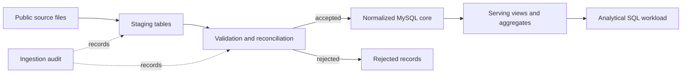

# Book Ratings Database Engineering

Designing and optimizing a MySQL database for integrated book ratings and
metadata.

## Project Objective

This project focuses on the database engineering challenges involved in
combining large book-rating data with metadata from multiple sources.

It is designed to demonstrate:

- normalized relational modeling with explicit keys and constraints;
- staged ingestion with source tracking and rejected-record handling;
- data-quality validation and source-to-target reconciliation;
- idempotent loading and ingestion auditing;
- workload-driven indexing and query-plan analysis;
- basic database operations such as least-privilege access, aggregate refresh,
  and backup/restore verification.

## Architecture



### Data layers

| Layer | Responsibility |
| --- | --- |
| Staging | Preserve source values and attach ingestion provenance |
| Validation | Apply data-quality rules and reconcile accepted and rejected rows |
| Core | Enforce normalized relationships, keys, constraints, and business rules |
| Serving | Provide workload-specific views and pre-aggregated tables |
| Operations | Track ingestion outcomes, refreshes, access roles, and recovery procedures |

## Core Model

| Table | Intended grain |
| --- | --- |
| `book` | One source-identifiable book edition |
| `reader` | One anonymized source user |
| `rating` | One accepted reader-book rating after deterministic duplicate resolution |
| `publisher` | One normalized publisher identity |
| `author` | One normalized author identity |
| `genre` | One normalized genre label |
| `book_author` | One unique book-author relationship |
| `book_genre` | One unique book-genre relationship |

### Source-integration decisions

| Source issue | Implemented policy |
| --- | --- |
| The source identifier column mixes ISBN and Amazon ASIN values | The current core is explicitly ISBN-10 scoped. `B0%` ASIN rows remain in staging and are quarantined with `unsupported_asin`; they are never cascade-deleted from core tables. |
| Amazon metadata has titles but no identifier | An exact title is mapped only when the selected ratings run links it to exactly one valid ISBN-10. Unmatched and ambiguous titles receive separate rejection codes. |
| A reader may have repeated ratings for one book | Keep the latest review date; use the latest staging row only as a deterministic tie-breaker. Record discarded rows as duplicates. |
| Sources disagree or contain repeated metadata | Apply field-level precedence and choose repeated metadata by completeness, then staging order. Avoid arbitrary `MAX()` selection. |
| Optional metadata is malformed | Null the affected field and retain an audit issue where possible instead of deleting the book. |
| Author and genre fields contain comma-delimited values | Split them into atomic relationships, normalize comparison keys, and preserve readable labels. |

The current model treats each valid ISBN-10 as a book edition. It does not
claim to identify a canonical work across editions.

## Repository Layout

```text
migrations/        ordered MySQL schema migrations
  001_...          ingestion audit and lossless staging
  002_...          ISBN validation and normalized core
  003_...          serving views and workload indexes
  004_...          hardened ISBN validation for malformed input
/sql/load/          local bulk-load script
/sql/transform/     validation, rejection logging, and idempotent core refresh
/sql/quality/       integrity, reconciliation, and coverage checks
/sql/workload/      representative analytical query
/data/sample/       committed synthetic edge-case fixtures
/tests/             end-to-end sample and repeatability checks
/data/README.md     local file contract; full snapshots remain gitignored
```

Raw CSV files are deliberately excluded from Git. The loader expects the local
files under `data/raw/`, following the contract in
[`data/README.md`](data/README.md), and records each file load as an
`ingestion_run`.

## Execution Order

1. Create an empty MySQL 8.4 database and apply all files in
   [`migrations/`](migrations/) by filename.
2. Place the source CSV files in the gitignored `data/raw/` directory.
3. Run [`sql/load/001_load_local_files.sql`](sql/load/001_load_local_files.sql)
   with `LOCAL INFILE` enabled.
4. Run
   [`sql/transform/001_refresh_core.sql`](sql/transform/001_refresh_core.sql).
   It validates the latest completed run for each source and rebuilds core
   tables in a transaction.
5. Run
   [`sql/quality/001_post_refresh_checks.sql`](sql/quality/001_post_refresh_checks.sql)
   and inspect the reconciliation and rejection profile.

## Fast Sample Verification

The committed synthetic fixtures exercise valid records, explicit rejections,
field-level nulling, duplicate resolution, ambiguous metadata, and repeatable
core refreshes without loading the full snapshots.

From a MySQL client started at the repository root with `LOCAL INFILE` enabled:

```sql
SOURCE tests/run_sample_idempotency.sql;
```

The runner recreates only `bookdb_sample_test`, applies all migrations, loads
the sample, transforms it twice, and compares counts plus business-key-based
signatures. A successful run ends with:

```text
PASS: sample transformation is repeatable
```

## Query Optimization Case

A book co-occurrence query will be used as a representative analytical
workload. Given a selected book, the query finds other books positively rated
by overlapping readers, aggregates shared-reader and rating statistics, and
enriches the results with available metadata.

This workload exercises:

- selective lookups and multi-table joins;
- deduplication and aggregation;
- large rating-table access paths;
- metadata enrichment;
- composite-index design;
- before-and-after analysis with `EXPLAIN ANALYZE`.

The query is included to demonstrate database design and performance analysis.
It is not presented as a validated recommendation model.

## Engineering Principles

- Invalid records must be rejected explicitly or quarantined, not hidden with
  `INSERT IGNORE`.
- Loading the same source twice must not create duplicate core records.
- Every table must have a documented grain and key policy.
- Indexes must be justified by an observed workload and execution plan.
- Pre-aggregated tables must have an explicit refresh strategy.
- Full raw datasets, database dumps, and credentials will not be committed.

## Implementation Status

- [ ] Select and document the final public datasets
- [ ] Add the MySQL Docker environment
- [x] Reconstruct and organize the original SQL decisions
- [x] Implement ordered schema migrations
- [x] Build staged loading and staging-to-core transformation
- [x] Add a synthetic reconciliation and repeatability smoke test
- [ ] Add constraint tests and GitHub Actions CI
- [ ] Record the query-optimization case study
- [ ] Add access-role and backup/restore checks
- [ ] Publish verified results and diagrams

## Project Background and Contribution

The project concept originated in a team database-management course project.
My primary responsibilities included data modeling, schema design, data
loading, data-quality handling, and query optimization.

This repository focuses on the database-engineering components that I design
and implement for public technical review.
