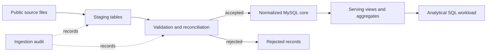

# Book Ratings Database Engineering

Designing and optimizing a MySQL database for integrated book ratings and
metadata.

## Project Objective

This project focuses on the database engineering challenges involved in
combining large book-rating data with metadata from multiple sources.

It is designed to demonstrate:

- normalized relational modeling with explicit keys and constraints;
- staged ingestion with source tracking and rejected-record handling;
- data-quality validation and source-to-target reconciliation;
- idempotent loading and ingestion auditing;
- workload-driven indexing and query-plan analysis;
- basic database operations such as least-privilege access, aggregate refresh,
  and backup/restore verification.

## Architecture

### Data layers

| Layer | Responsibility |
| --- | --- |
| Staging | Preserve source values and attach ingestion provenance |
| Validation | Apply data-quality rules and reconcile accepted and rejected rows |
| Core | Enforce normalized relationships, keys, constraints, and business rules |
| Serving | Provide workload-specific views and pre-aggregated tables |
| Operations | Track ingestion outcomes, refreshes, access roles, and recovery procedures |

## Planned Core Model

| Table | Intended grain |
| --- | --- |
| `book` | One source-identifiable book edition |
| `reader` | One anonymized source user |
| `rating` | One accepted user-book rating under the documented duplicate policy |
| `publisher` | One normalized publisher identity |
| `author` | One normalized author identity |
| `genre` | One normalized genre label |
| `book_author` | One unique book-author relationship |
| `book_genre` | One unique book-genre relationship |

Important design decisions will include:

- selecting stable keys across ISBN, ASIN, and other source identifiers;
- distinguishing a book edition from a canonical work;
- defining how repeated user-book ratings are resolved;
- preserving the meaning of implicit and explicit ratings;
- applying deterministic metadata precedence when sources disagree.

## Query Optimization Case

A book co-occurrence query will be used as a representative analytical
workload. Given a selected book, the query finds other books positively rated
by overlapping readers, aggregates shared-reader and rating statistics, and
enriches the results with available metadata.

This workload exercises:

- selective lookups and multi-table joins;
- deduplication and aggregation;
- large rating-table access paths;
- metadata enrichment;
- composite-index design;
- before-and-after analysis with `EXPLAIN ANALYZE`.

The query is included to demonstrate database design and performance analysis.
It is not presented as a validated recommendation model.

## Engineering Principles

- Invalid records must be rejected explicitly or quarantined, not hidden with
  `INSERT IGNORE`.
- Loading the same source twice must not create duplicate core records.
- Every table must have a documented grain and key policy.
- Indexes must be justified by an observed workload and execution plan.
- Pre-aggregated tables must have an explicit refresh strategy.
- Full raw datasets, database dumps, and credentials will not be committed.

## Implementation Status

- [ ] Select and document the final public datasets
- [ ] Add the MySQL Docker environment
- [ ] Implement ordered schema migrations
- [ ] Build staging-to-core ingestion
- [ ] Add integrity, reconciliation, and idempotency tests
- [ ] Record the query-optimization case study
- [ ] Add access-role and backup/restore checks
- [ ] Publish verified results and diagrams

## Project Background and Contribution

The project concept originated in a team database-management course project.
My primary responsibilities included data modeling, schema design, data
loading, data-quality handling, and query optimization.

This repository focuses on the database-engineering components that I design
and implement for public technical review.
